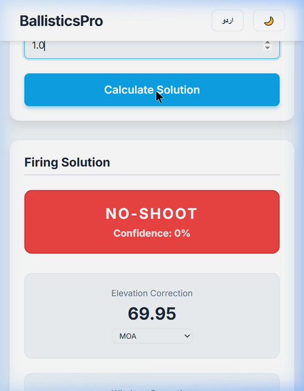
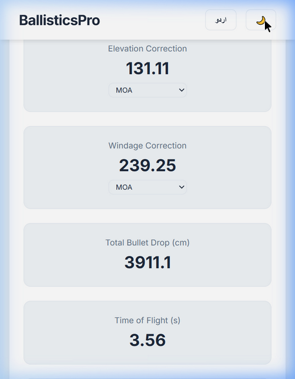
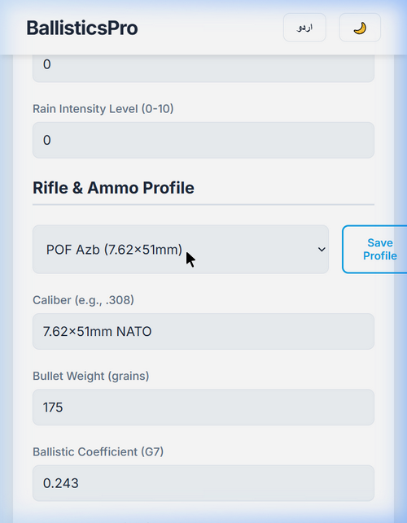
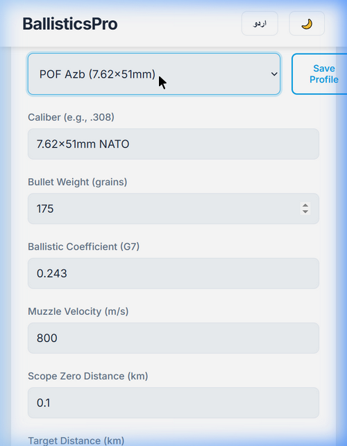

# 🎯 BallisticsPro — Professional Sniper Ballistics Calculator

<p align="center">
  
  &nbsp;&nbsp;
  
</p>

<p align="center">
  
  
  
  
</p>

---

> ⚠️ **AUTHORIZED USE ONLY**
> This application is strictly intended for **authorized security agencies, military personnel, and licensed professional shooters** only. Unauthorized use is strictly prohibited.

> ⚠️ **صرف مجاز اداروں کے لیے**
> یہ ایپلیکیشن صرف **قانونی سیکورٹی ایجنسیوں، فوجی اہلکاروں، اور لائسنس یافتہ پیشہ ور نشانہ بازوں** کے استعمال کے لیے ہے۔

---

## ✨ Features / فیچرز

| Feature | Description |
|---------|-------------|
| 🌡️ **Environmental Inputs** | Wind, Humidity, Temperature, Pressure, Altitude, Rain |
| 🏎️ **Moving Targets** | Target Speed & Angle input with automatic Lead calculation |
| 🔫 **18+ Rifle Profiles** | 10 World + 8 Pakistan Army/SSG Rifles Pre-loaded |
| 🎯 **G7 Ballistic Model** | Point-mass trajectory with G7 drag function |
| 🌀 **Coriolis & Spin Drift** | Full Earth rotation & barrel twist corrections |
| 📐 **Multi-Unit Output** | MOA / MRAD / Clicks / Inches / CM |
| 🟢 **Smart Advisory** | SHOOT / WAIT / NO-SHOOT with confidence % |
| 🔭 **AR Sniper Scope** | Live camera feed with Mil-Dot reticle + Holdover & Lead Dot |
| 🌙 **Night Mode** | Red-screen display for night vision preservation |
| 🇵🇰 **Urdu + English** | Full bilingual support with RTL layout |
| 📴 **100% Offline** | No internet required after first load |
| 📄 **PDF Range Card** | Export firing solutions as printable PDF |
| 💾 **Custom Profiles** | Save unlimited rifle configurations locally |

---

## 📱 Screenshots / اسکرین شاٹس

| Main Input | Rifle Profile |
|:---:|:---:|
|  |  |

| Firing Solution | Full Results |
|:---:|:---:|
|  |  |

---

## 🔫 Built-in Rifle Profiles

### 🌍 World Top 10 Sniper Rifles
| Rifle | Caliber | Bullet | G7 BC | Velocity |
|-------|---------|--------|-------|----------|
| Barrett M82A1 | .50 BMG | 750gr | 0.350 | 853 m/s |
| CheyTac M200 | .408 CheyTac | 419gr | 0.435 | 884 m/s |
| AI AWM | .338 Lapua Mag | 250gr | 0.322 | 900 m/s |
| Sako TRG 42 | .338 Lapua Mag | 300gr | 0.340 | 826 m/s |
| Remington M24 | 7.62x51mm NATO | 175gr | 0.243 | 790 m/s |
| M2010 ESR | .300 Win Mag | 220gr | 0.320 | 868 m/s |
| Dragunov SVD | 7.62x54mmR | 152gr | 0.220 | 830 m/s |
| Steyr SSG 69 | 7.62x51mm NATO | 168gr | 0.225 | 800 m/s |
| McMillan TAC-50 | .50 BMG | 750gr | 0.350 | 823 m/s |
| AS50 | .50 BMG | 750gr | 0.350 | 823 m/s |

### 🇵🇰 Pakistan Army / SSG Rifles
| Rifle | Caliber | Bullet | Notes |
|-------|---------|--------|-------|
| POF Azb | 7.62x51mm NATO | 175gr | Indigenous Pakistani bolt-action |
| POF PSR-90 | 7.62x51mm NATO | 175gr | Semi-auto precision |
| Steyr SSG 69 – PAK SSG | 7.62x51mm NATO | 168gr | SSG Commandos |
| AI AWM – PAK Army | .338 Lapua Mag | 250gr | PAF & Special Units |
| RPA Quadlite | .338 Lapua Mag | 250gr | Special Forces |
| Dragunov SVD – PAK FC | 7.62x54mmR | 152gr | LoC & Afghan Border |
| Barrett M82A1 – PAK Army | .50 BMG | 750gr | Anti-materiel |
| POF G3 SG/1 | 7.62x51mm NATO | 147gr | POF Licence-built |

---

## 🚀 Quick Start / فوری شروعات

### Option 1 — Open in Browser (Instant)
```
1. Download/clone this repository
2. Double-click  index.html
3. App opens in your browser — no server needed!
```

### Option 2 — Install on Android (PWA)
```
1. Open index.html on Android Chrome browser
2. Tap the browser menu (⋮)
3. Tap "Add to Home Screen"
4. App installs like a native APK!
```

### Option 3 — Build Native APK
```powershell
# Install Node.js first: https://nodejs.org
# Then right-click BUILD_APK.ps1 → Run with PowerShell
```
See `BUILD_APK.ps1` for the automated build script.

---

## 📖 Documentation / دستاویزات

| Document | Description |
|----------|-------------|
| [APP_USAGE_GUIDE.md](APP_USAGE_GUIDE.md) | Complete step-by-step usage guide (Urdu + English) |
| [DEVELOPER_GUIDE.md](DEVELOPER_GUIDE.md) | Technical guide for developers |
| [SALES_GUIDE.md](SALES_GUIDE.md) | Commercial licensing & pricing information |
| [BUILD_APK.ps1](BUILD_APK.ps1) | Automated Android APK build script |

---

## 🏗️ Project Structure / پروجیکٹ ڈھانچہ

```
BallisticsPro/
├── index.html              # Main app UI
├── style.css               # Material Design styling + Night Mode
├── app.js                  # App logic, i18n, profiles, AR scope
├── ballistics.js           # Physics engine (G7, Coriolis, Spin Drift)
├── manifest.json           # PWA manifest (Android install)
├── BUILD_APK.ps1           # Android APK build script
├── screenshots/
│   ├── screenshot_1_main_form.png
│   ├── screenshot_2_rifle_profile.png
│   ├── screenshot_3_firing_solution.png
│   └── screenshot_4_results.png
├── README.md               # This file
├── APP_USAGE_GUIDE.md      # Usage documentation
├── DEVELOPER_GUIDE.md      # Developer documentation
└── SALES_GUIDE.md          # Commercial licensing guide
```

---

## ⚙️ Technical Stack

- **Platform:** Vanilla HTML5 + CSS3 + JavaScript (Zero dependencies)
- **Physics:** Point-Mass Ballistic Model, G7 Drag Function
- **AR:** WebRTC Camera API + SVG Mil-Dot Reticle
- **Storage:** localStorage (offline profiles)
- **PWA:** Web App Manifest + Progressive Enhancement
- **i18n:** Custom bilingual dictionary (English + Urdu/RTL)

---

## 📜 License / لائسنس

```
RESTRICTED LICENSE
This software is licensed exclusively for use by:
- Authorized government security agencies
- Military and law enforcement organizations
- Licensed professional shooters

Commercial resale requires written authorization.
Unauthorized distribution is prohibited.

© 2025 BallisticsPro. All rights reserved.
```

---

## 👨‍💻 Developer Contact

**GitHub:** [@zeeshansarwar1986](https://github.com/zeeshansarwar1986)
**Repository:** [BallisticsPro](https://github.com/zeeshansarwar1986/BallisticsPro)
